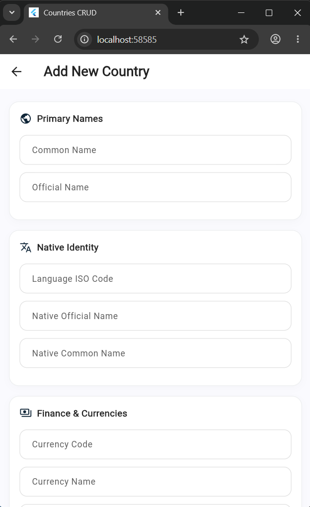
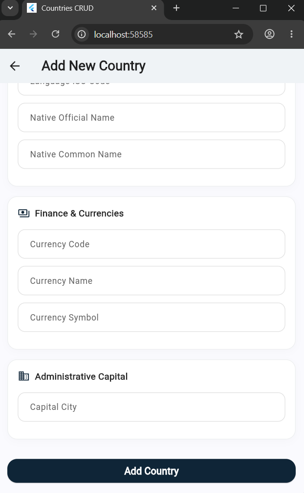
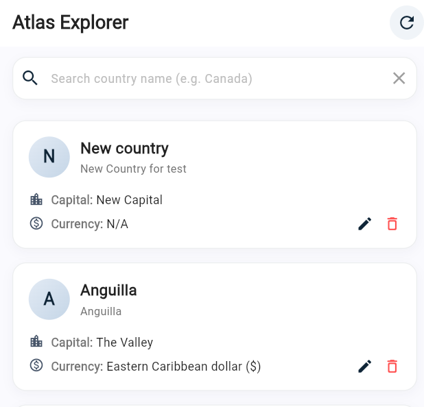
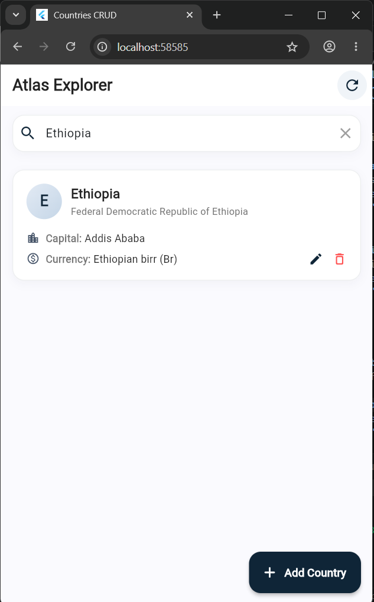
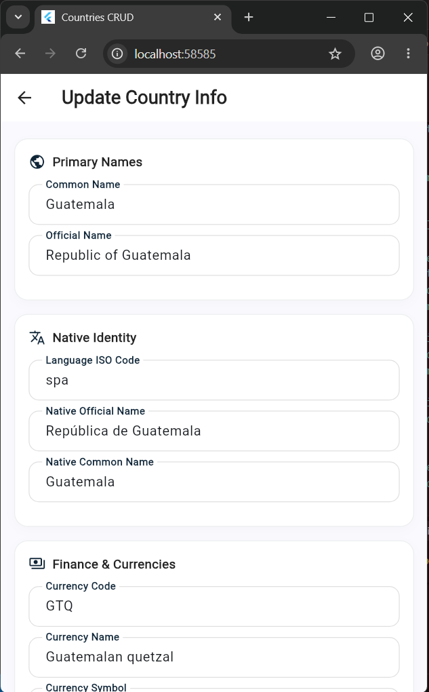
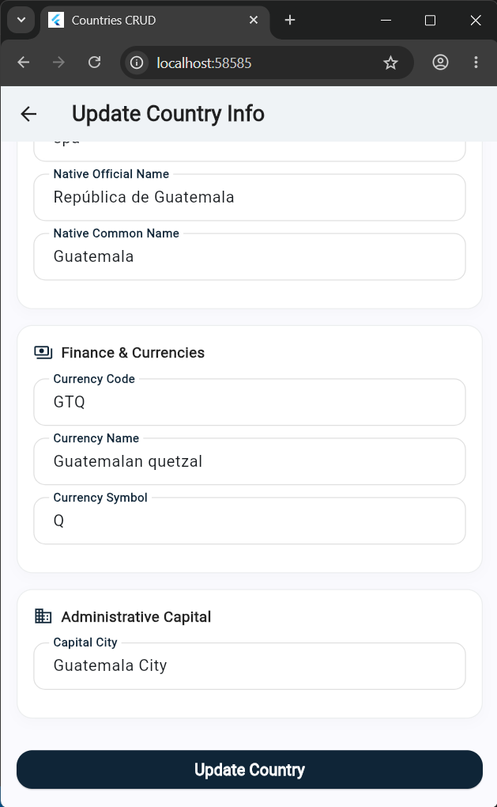
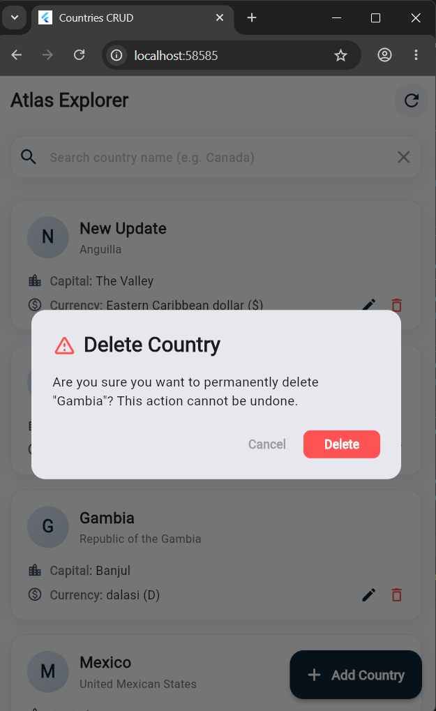
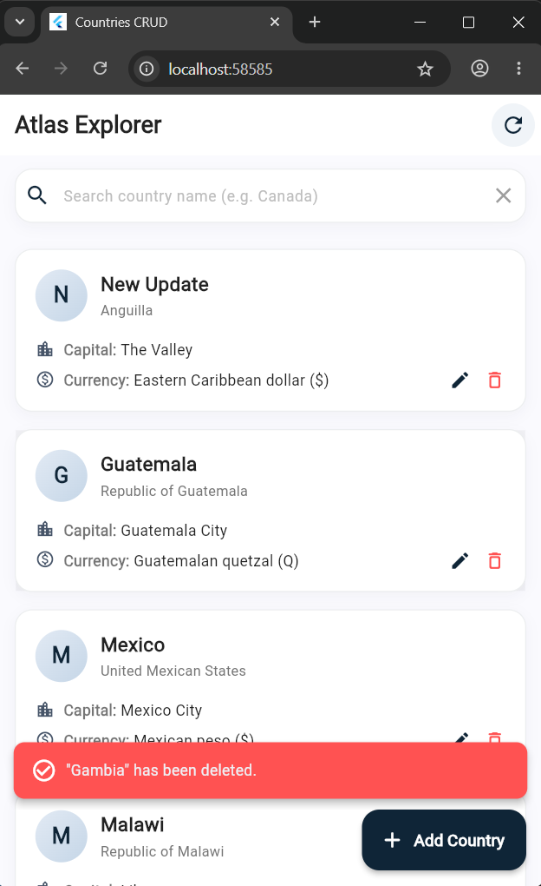

# Atlas Explorer

**Atlas Explorer** is a Flutter application designed for exploring and registering countries globally. Powered by the standard **HTTP Client** and structured with **Provider State Management**.

---

## CRUD Operations & Live Application Screenshots

Here is a visual showcase of the core **CRUD** (Create, Read, Update, Delete) operations running in the Flutter Web environment:

### 1. Create Operation (C)
Allows users to discover and add new countries into the Atlas. It features organized **Section Cards** (Primary Names, Native Identity, Finance & Currencies, Administrative Capital) with full validation, and a solid action button at the bottom.

#### Form View (Top Section Inputs)
<p align="center">
  
</p>

#### Form View (Bottom Section & Add Action)
<p align="center">
  
</p>

---

### 2. Read Operation (R)
Loads and lists all registered countries using Provider state, capsule-shaped search panels, and dynamic pagination toggles.

#### Main Dashboard & Explorer List
Includes custom country cards displaying capital cities and active currencies in a clean layout with generous breathing room.
<p align="center">
  
</p>

#### Filtering & Search Operations
Allows finding registered countries instantly using the top search bar (e.g., search queries like "Ethiopia").
<p align="center">
  
</p>

---

### 3. Update Operation (U)
Allows modifying registered country records. Opening a country pre-fills all fields in the multi-section form.

#### Edit Country Form (Guatemala Pre-filled - Top)
<p align="center">
  
</p>

#### Edit Country Form (Scrolled to bottom - Capital City)
<p align="center">
  
</p>

---

### 4. Delete Operation (D)
Allows removing a country record instantly. It triggers a custom **Warning Alert Dialog** confirming the user's action.

#### Warning Confirm Dialog
<p align="center">
  
</p>

#### Successful Deletion Feedback Toast
Shows a beautiful custom floating `SnackBar` confirming success.
<p align="center">
  
</p>

---

##  Quick Start & Installation

### Prerequisites
Make sure you have [Flutter SDK](https://flutter.dev/docs/get-started/install) installed on your machine.

### Setup Instructions
1. **Clone the repository:**
   ```bash
   git clone https://github.com/Efrata-Habte/CRUD-API-consumption.git
   ```

2. **Navigate to the Flutter project directory:**
   ```bash
   cd CRUD-API-consumption/crud_api_consumption_http
   ```

3. **Install dependencies:**
   ```bash
   flutter pub get
   ```

4. **Run the application:**
   ```bash
   flutter run
   ```

---

## Tech Stack & Libraries
- **Language**: [Dart / Flutter](https://flutter.dev/)
- **State Management**: [provider](https://pub.dev/packages/provider) (ChangeNotifier)
- **Networking**: [http](https://pub.dev/packages/http) (HTTP client with custom payload serializers and patch mergers)
- **Typography & Icons**: Material Icons & custom Navy Blue palettes